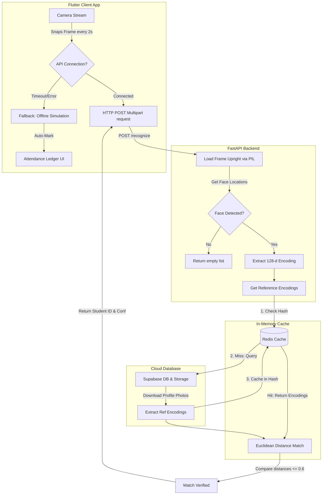

# 📸 Vision-Based Attendance App

A real-time, AI-powered attendance tracking system designed for academic institutions. The system features a mobile Flutter application for instructors and students, backed by a FastAPI face recognition server, Supabase (for database & storage), and Redis (for low-latency embedding caching).

---

## 🏗️ System Architecture

The application operates on a client-server architecture separating live video frame streaming, state synchronization, and core face recognition processing.



### Flow Breakdown
1. **Live Scanning**: The instructor opens the camera screen, which automatically starts taking a photo frame every 2 seconds.
2. **REST API Ingestion**: Frame bytes are sent via a multipart `POST /recognize` request to the FastAPI backend.
3. **Caching Layer (Redis)**:
   * The backend checks if the 128-dimensional face embedding vectors for enrolled students of that specific course are cached in Redis.
   * **Cache Hit**: Employs stored numpy arrays directly, cutting database roundtrip and image download latency.
   * **Cache Miss**: Dynamically queries enrolled student profiles from Supabase, downloads reference images from Supabase Storage, extracts reference encodings, writes them to a Redis hash map with a 2-hour TTL, and runs the matching check.
4. **Distance Matching**: Euclidean distances are calculated between live faces and reference profiles. Any distance $\le 0.6$ (dlib threshold) is verified, and the client marks the student as **Present**.
5. **Failover**: If the phone is offline or the server is unreachable, the client falls back to **Offline (Sim)** mode, executing a simulated timer matching algorithm.

---

## ✨ Features

### 1. Instructor Core
* **Course & Section Management**: Create, edit, and delete courses. Manage multiple class sections under identical course titles.
* **Student Enrollment**: Add/remove student accounts to/from specific course sections.
* **Smart Face Attendance**:
  * Scans multiple students simultaneously through the rear camera.
  * Real-time **Live AI** status indicator badge showing server connectivity.
  * Automatic local simulation fallback if the backend drops.
* **Attendance Ledger**: View a tabular matrix showing student details alongside status columns for each scheduled lecture date.

### 2. Student Core
* **Face Registration**: Snap and upload a profile picture during signup to generate the reference facial embedding vector.
* **Skip Option**: Skip image registration during signup with the ability to upload a face profile from the dashboard later.
* **Real-time Stats**: View course-by-course attendance percentages and detailed session history.

### 3. Backend Face Recognition API
* **Exif Auto-Rotation**: Employs `ImageOps.exif_transpose` to automatically rotate landscape-saved mobile photos upright, ensuring consistent face detection.
* **Redis Caching**: Highly optimized storage hashes for fast lookup ($O(1)$) of serialized C++ double-float matrices.
* **Swagger API Documentation**: Auto-generated interactive endpoint docs available out-of-the-box.

---

## 🗄️ Database Schema

The database is built on **Supabase (PostgreSQL)**:

### `profiles`
Stores user profile information for both students and instructors.
```sql
CREATE TABLE public.profiles (
    id uuid REFERENCES auth.users ON DELETE CASCADE PRIMARY KEY,
    name text NOT NULL,
    email text NOT NULL UNIQUE,
    role text NOT NULL CHECK (role IN ('student', 'instructor')),
    registration_number text,
    department text,
    face_url text, -- Public URL of the uploaded profile face image
    created_at timestamp with time zone DEFAULT timezone('utc'::text, now()) NOT NULL
);
```

### `courses`
Stores course details managed by instructors.
```sql
CREATE TABLE public.courses (
    id uuid DEFAULT gen_random_uuid() PRIMARY KEY,
    name text NOT NULL,
    code text NOT NULL,
    section text NOT NULL,
    instructor_id uuid REFERENCES public.profiles(id) ON DELETE CASCADE,
    created_at timestamp with time zone DEFAULT timezone('utc'::text, now()) NOT NULL
);
```

### `enrollments`
Links students to the courses they are attending.
```sql
CREATE TABLE public.enrollments (
    id uuid DEFAULT gen_random_uuid() PRIMARY KEY,
    course_id uuid REFERENCES public.courses(id) ON DELETE CASCADE,
    student_id uuid REFERENCES public.profiles(id) ON DELETE CASCADE,
    created_at timestamp with time zone DEFAULT timezone('utc'::text, now()) NOT NULL,
    UNIQUE(course_id, student_id)
);
```

### `attendance_sessions`
Represents an instance of an attendance roll-call session.
```sql
CREATE TABLE public.attendance_sessions (
    id uuid DEFAULT gen_random_uuid() PRIMARY KEY,
    course_id uuid REFERENCES public.courses(id) ON DELETE CASCADE,
    instructor_id uuid REFERENCES public.profiles(id) ON DELETE CASCADE,
    lecture_name text NOT NULL,
    date date NOT NULL,
    created_at timestamp with time zone DEFAULT timezone('utc'::text, now()) NOT NULL
);
```

### `attendance_records`
Logs individual student attendance records matching a specific session.
```sql
CREATE TABLE public.attendance_records (
    id uuid DEFAULT gen_random_uuid() PRIMARY KEY,
    session_id uuid REFERENCES public.attendance_sessions(id) ON DELETE CASCADE,
    student_id uuid REFERENCES public.profiles(id) ON DELETE CASCADE,
    is_present boolean NOT NULL DEFAULT false,
    confidence double precision,
    detected_at timestamp with time zone,
    created_at timestamp with time zone DEFAULT timezone('utc'::text, now()) NOT NULL,
    UNIQUE(session_id, student_id)
);
```

---

## 🚀 Setting Up the Application

### 1. Start the Redis Server
```bash
# Start background service via Homebrew
brew services start redis
```

### 2. Configure & Run the Backend
1. Install system prerequisites:
   ```bash
   brew install cmake libpng jpeg
   ```
2. Navigate to the backend folder and install Python packages:
   ```bash
   cd backend
   pip3 install -r requirements.txt
   ```
3. Start the FastAPI server:
   ```bash
   uvicorn main:app --host 0.0.0.0 --port 8000 --reload
   ```

### 3. Run the Flutter Mobile App
1. Set up your `.env` configuration file in `app/.env`:
   ```env
   SUPABASE_URL=https://your-supabase-url.supabase.co
   SUPABASE_ANON_KEY=your-supabase-anon-key
   
   # For physical devices, replace localhost with your Mac's Local Wi-Fi IP (e.g. 192.168.100.80)
   RECOGNITION_API_URL=http://192.168.100.80:8000
   ```
2. Launch the client:
   ```bash
   cd app
   flutter pub get
   flutter run
   ```
